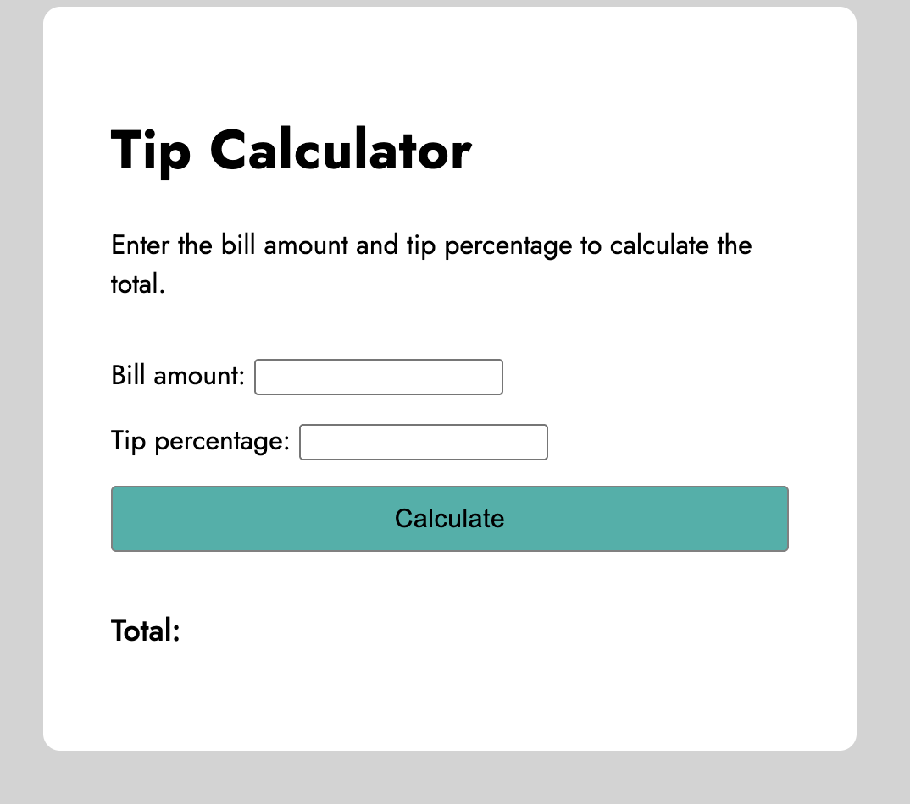

# tip-calculator

## Table of contents

- [Overview](#overview)
  - [Screenshot](#screenshot)
  - [Links](#links)
  - [Built with](#built-with)
  - [Continued development](#continued-development)
- [Author](#author)
- [Acknowledgments](#acknowledgments)

## Overview

In this project, the aim is to build a modern tip calculator. The project's primary interface comprises a container labeled "Tip Calculator" with two input fields: one for the bill amount and the other for the tip percentage. The tip calculator has a modern design that is styled using CSS. I utilized JavaScript to obtain the values of the two input fields and calculate the total amount based on these values.

### Screenshot

### Links

- Solution URL: [https://github.com/kpuzzonia/tip-calculator](https://github.com/kpuzzonia/tip-calculator)
- Live Site URL: [https://kpuzzonia.github.io/tip-calculator/](https://kpuzzonia.github.io/tip-calculator/)

### Built with

- Semantic HTML5 markup
- CSS
- Flexbox
- JavaScript

### Continued development

The current tip calculator does not include any error handling on the JavaScript side. I would like to coninue working on this project by adding basic error handling. 

## Author

- Website - [Kari Puzzonia](https://www.linkedin.com/in/kari-puzzonia/)
- GitHub - [@kpuzzonia](https://github.com/kpuzzonia)
- Instagram - [@codewithkari](https://www.instagram.com/codewithkari/)

